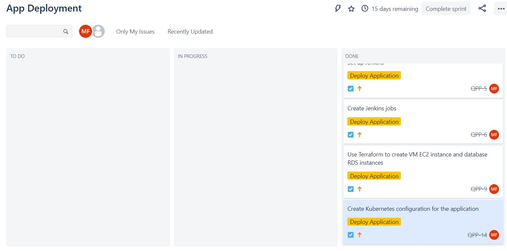

# Practical_Project
This is the repo for my second SFIA project at the Academy.
# Python Flask Application Deployment 
## Resources
* Presentation: [Click here](https://docs.google.com/presentation/d/1NJpYo0K-EeJBOkFFINH8T6LNguUHpQIr4U6fiexdNcs/edit?usp=sharing)
## Contents 
* [Overview](#overview)
   * [Brief](#brief)
   * [Requirements](#requirements)
* [Documentation](#documentation)
   * [Kanban board](#kanban-board)
   * [CI Pipeline](#ci-pipeline)
   * [Risk Assessment](#risk-assessment)
* [Tools used](#tools-used)
## Overview
### Brief
The brief for this application is the following: To efficiently deploy a simple Flask application making use of a range of tools. 
### Requirements
The requirements for the application are the following:
- A Jira board with full expansion on tasks needed to complete the project.
- This could also provide a record of any issues or risks that you faced creating your project.
- The application must be deployed using containerisation and orchestration tools.
- The application must be tested through the CI pipeline.
- The project must make use of two managed Database Servers: 1 for Testing and 1 for Production.
- If a change is made to the code base, Webhooks should be used so that Jenkins recreates and redeploys the changed application.
- The infrastructure for the project should be configured using an infrastructure management tool (Infrastructure as Code).
- As part of the project, you need to create an Ansible Playbook that will provision the environment that your CI Server needs to run.
- The project must make use of a reverse proxy to make your application accessible to the user.

## Documentation
Tip: Click on screenshots to view them
### Kanban board 
You can find a screenshot of the Kanban board built on Jira below:

### CI Pipeline
Jenkins was used as the CI server to deploy the application. Webhooks were used to ensure that when a user pushes to the repository, it kicks of the Jenkins pipeline.
- Development: Jenkinsfile1 is the file used for the test environment, it uses SSH to deploy the app onto a virtual machine for testing purposes and stores the python test results in a file in the directory. 
- Deployment: Jenkinsfile is the file used for deployment. It essentially builds a frontend image, pushes it to DockerHub and then updates that onto the Kubernetes Cluster. 
### Risk Assessment
You can view the risk assessment for this project below:

## Tools used
- AWS EC2 instance and RDS instances 
- Jira for project management 
- Git and GitHub for version control
- Jenkins for the CI server
- Docker/Docker Compose for containerisation
- Ansible is good for configuration management and was used in this project to put Jenkins on the virtual machine
- Terraform is a Infrastructure as Code tool that was used to create the infrastructure needed for this project. 
- NGINX is a very popular tool that was used in this project to act as a reverse proxy to make the frontend available to the user
- Kubernetes is a great container orchestration tool and was used in this project to deploy the application to a Kubernetes cluster in GCP as it is free, however AWS EKS was also tested using the terraform config. 
## Authors/Contributors
Author: Macaulay Farrell, the only contributor was Macaulay Farrell for this project.

